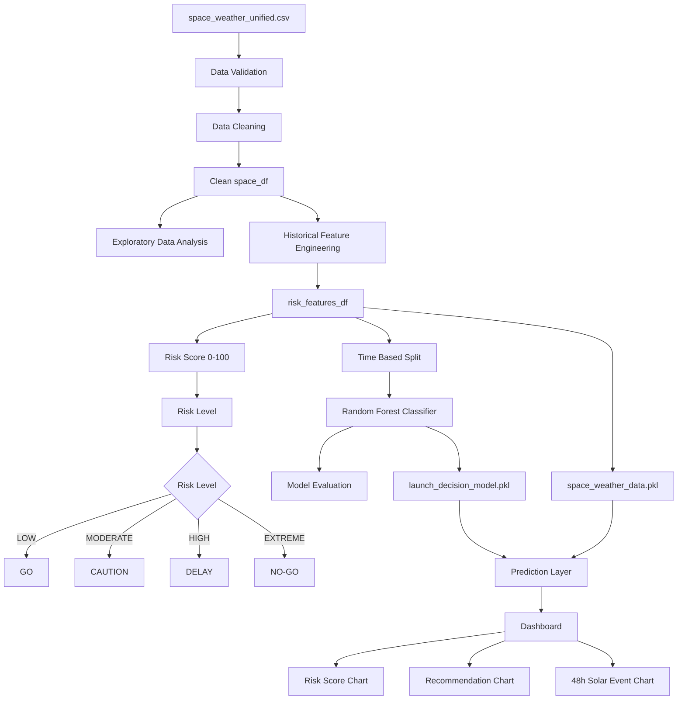

# Space Weather Launch Safety Predictor

## Overview

## Problem Statement

## Objectives

## Dataset

### Dataset Columns

## System Architecture

## Project Structure

## Technology Stack

## Machine Learning Workflow

### Data Cleaning

### Feature Engineering

### Risk Scoring

### Random Forest Model

### Model Evaluation

## Dashboard

## Installation

## Running the Notebook

## Running the Pipeline

## Running the Dashboard

## Testing

## Example Output

## Risk-Level Interpretation

## Limitations

## Educational Disclaimer

## Future Improvements

## Author

## System Flowchart

